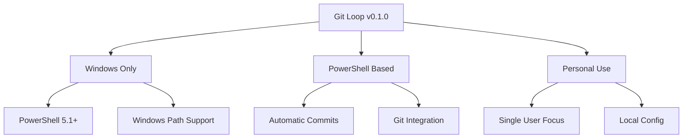
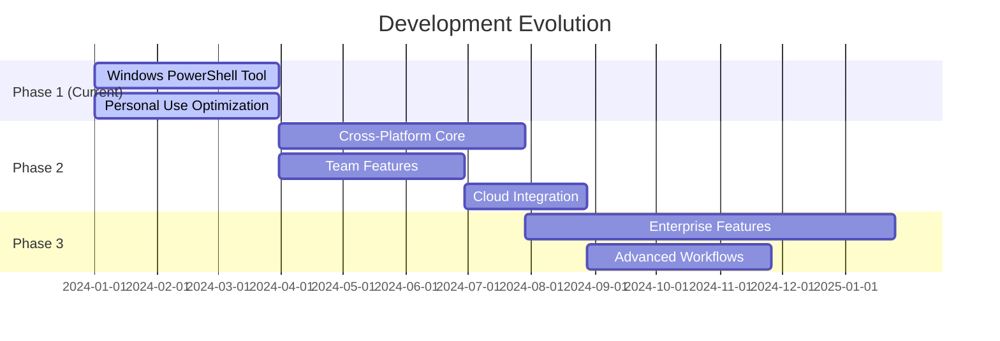

# Git Loop (PowerShell)

## Project Status
- **Version**: 0.1.0-alpha
- **Last Updated**: 2024
- **Platform**: Windows-only (Currently)
- **Status**: Personal Development Tool

> **Note**: This is the first iteration of Git Loop, currently designed as a Windows-specific PowerShell tool for personal use. Future versions will expand into a full-featured, cross-platform team development solution.

A PowerShell-based Git repository synchronization tool that automatically commits and syncs changes across multiple repositories. Each commit is tagged with "Git Loop (PowerShell)" for easy identification.

## 🎯 Current Scope



- 🪟 **Windows-Specific Features**
  - PowerShell automation
  - Windows path handling
  - Local system integration

- 🔄 **Current Capabilities**
  - Automatic commits with "Git Loop (PowerShell)" signature
  - Basic multi-repository sync
  - Local configuration management

- 🏠 **Personal Use Focus**
  - Single user workflow
  - Local system optimization
  - Personal repository management

## 🚀 Vision & Roadmap



### Future Evolution
1. **Phase 1 (Current)**
   - ✅ Windows PowerShell implementation
   - ✅ Personal workflow optimization
   - ✅ Basic repository synchronization

2. **Phase 2 (Planned)**
   - 🔲 Cross-platform support (Python/Node.js)
   - 🔲 Team collaboration features
   - 🔲 Cloud integration
   - 🔲 Web interface

3. **Phase 3 (Future)**
   - 🔲 Enterprise-grade features
   - 🔲 Team permission management
   - 🔲 Advanced workflow automation
   - 🔲 CI/CD integration

## ⚙️ Current Setup (Windows)

### Prerequisites
- Windows 10/11
- PowerShell 5.1 or later
- Git for Windows
- .NET Framework 4.5+

### Installation
```powershell
# Clone to your Windows system
git clone git@github.com:ih8sirdavi/Git-Loop.git
cd "Git Loop"

# Run the PowerShell script
.\Git_Loop.ps1
```

### Configuration
Windows-specific configuration file (`config`):
```json
{
    "Repositories": [
        {
            "Name": "Git Loop",
            "Path": "D:\\Projects\\Git Loop",
            "Branch": "main",
            "RemoteUrl": "git@github.com:username/repo.git",
            "AutoSync": true
        }
    ],
    "SyncInterval": 30,
    "MaxRetries": 3,
    "LogRetention": 100,
    "LogFile": "GitLoop.log",
    "MaxLogSize": "5MB"
}
```

### Windows Directory Structure
```
Git Loop/
├── Git_Loop.ps1      # PowerShell main script
├── config            # Windows-specific configuration
├── config.example    # Configuration template
├── logs/            # Windows log directory
│   ├── GitLoop.log   # Operation logs
│   └── config.backup # Configuration backup
└── .gitignore       # Git ignore rules
```

## 🔍 Current Limitations

- Windows-only support
- PowerShell dependency
- Single user focus
- Basic authentication
- Local configuration only

## 🛠 Development Notes

### Current Implementation
- PowerShell-based automation
- Windows file system integration
- Local Git operations
- Single user authentication
- Basic error handling

### Commit Signatures
All automatic commits are tagged with:
```
Git Loop (PowerShell) - [Operation Type]
```

Example commit messages:
- "Git Loop (PowerShell) - Auto-sync repository"
- "Git Loop (PowerShell) - Configuration backup"
- "Git Loop (PowerShell) - Log rotation"

## 📄 License

This project is licensed under the MIT License - see the LICENSE file for details.

## 👤 Author

Created by ih8sirdavi for personal Windows development workflow automation.

## 🙏 Acknowledgments

- PowerShell scripting community
- Git for Windows
- Windows development tools

---

> **Future Updates**: While currently a Windows-specific PowerShell tool, Git Loop is planned to evolve into a comprehensive, cross-platform team development platform. Stay tuned for updates!
