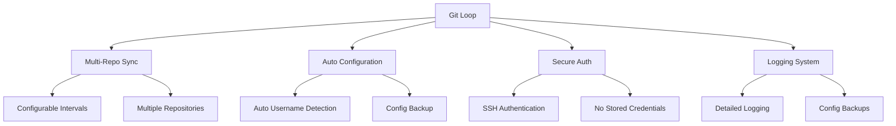
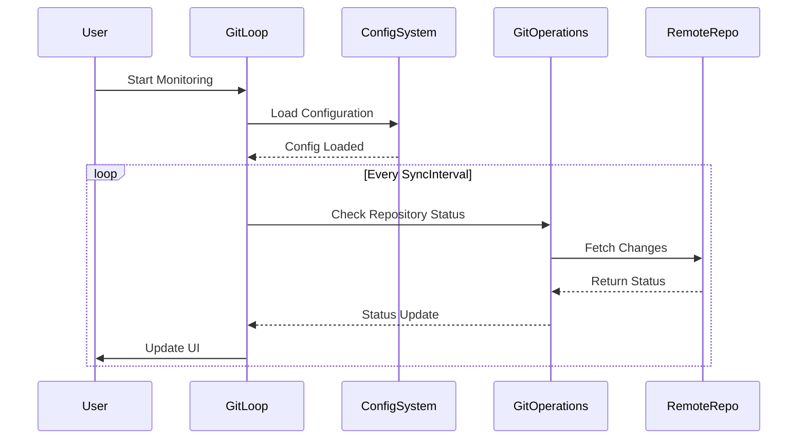
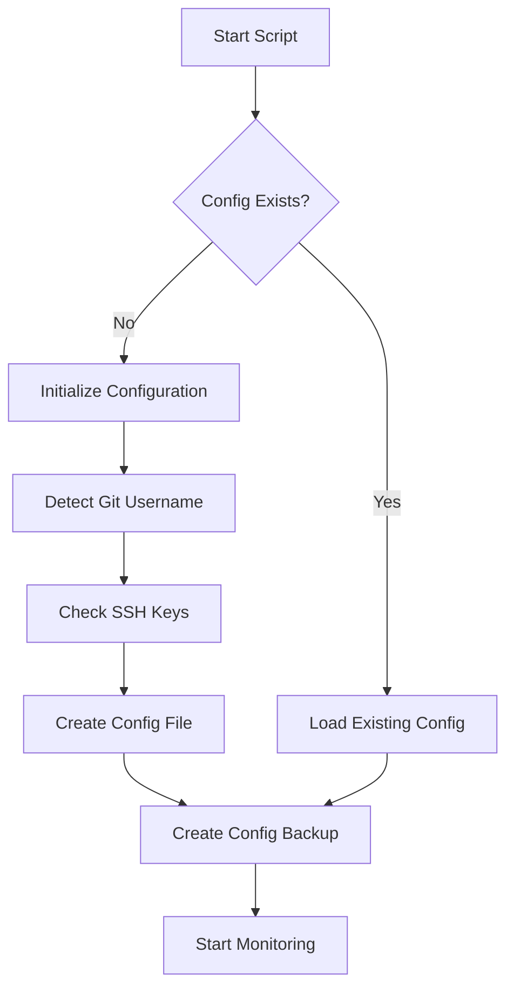
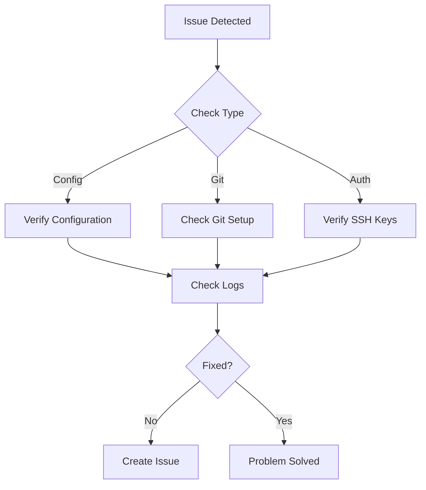
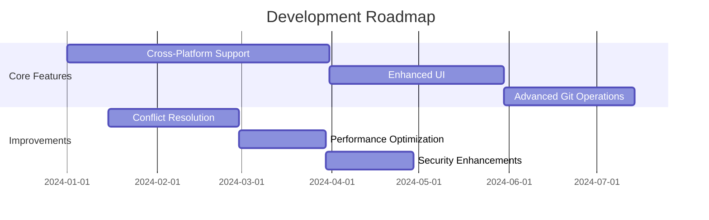

# Git Loop

## Project Status
- **Version**: 1.0.0
- **Last Updated**: 2024
- **Status**: Active Development

An automated Git repository synchronization tool that keeps multiple repositories in sync with minimal user intervention.

## 🌟 Key Features



- 🔄 **Automatic Synchronization**
  - Multi-repository support
  - Configurable sync intervals
  - Intelligent conflict handling

- 🔐 **Secure Authentication**
  - SSH key support
  - No credential storage
  - User permission based

- 📝 **Smart Configuration**
  - Auto-detection of Git settings
  - Configuration backups
  - Template-based setup

## 🏗 System Architecture



## 📦 Installation

1. Clone this repository:
```powershell
git clone git@github.com:ih8sirdavi/Git-Loop.git
```

2. Ensure prerequisites:
   - Git installed and configured
   - PowerShell 5.1 or later
   - .NET Framework 4.5+

3. Run the script:
```powershell
.\Git_Loop.ps1
```

### First Run Process



## ⚙️ Configuration

The tool uses a JSON configuration file with the following structure:

```json
{
    "Repositories": [
        {
            "Name": "Repository Name",
            "Path": "D:\\Path\\To\\Repository",
            "Branch": "main",
            "RemoteUrl": "git@github.com:username/repo.git",
            "AutoSync": true
        }
    ],
    "SyncInterval": 30,
    "MaxRetries": 3,
    "LogRetention": 100,
    "LogFile": "GitLoop.log",
    "MaxLogSize": "5MB"
}
```

### 📁 Directory Structure

```
Git Loop/
├── Git_Loop.ps1      # Main script
├── config            # Your configuration (ignored by Git)
├── config.example    # Configuration template
├── logs/            # Log directory
│   ├── GitLoop.log   # Operation logs
│   └── config.backup # Configuration backup
└── .gitignore       # Git ignore rules
```

## 🔒 Security

- Uses SSH for authentication
- No credentials stored in script
- Runs with your Git permissions
- Configuration files not tracked in Git

## 🔍 Troubleshooting



1. Run with verbose logging:
```powershell
.\Git_Loop.ps1 -Verbose
```

2. Check logs at `logs/GitLoop.log`
3. Verify SSH key configuration
4. Ensure Git is properly configured

## 🤝 Contributing

1. Fork the repository
2. Create your feature branch
3. Commit your changes
4. Push to the branch
5. Create a Pull Request

## 📄 License

This project is licensed under the MIT License - see the LICENSE file for details.

## 🙏 Acknowledgments

- PowerShell Windows Forms
- Git command line interface
- Modern UI design principles

## 🔮 Future Plans



See [Future Enhancements](#future-enhancements) for detailed plans.

## Future Enhancements

- **Advanced Repository Management**
  - Branch-specific configurations and policies
  - Support for multiple branch monitoring
  - Custom pre-commit and post-commit hooks
  - Repository health checks and diagnostics

- **Enhanced Conflict Resolution**
  - Interactive conflict resolution interface
  - Configurable conflict resolution strategies
  - Backup creation before conflict resolution
  - Visual diff tool integration

- **Extended UI Features**
  - Dark mode support
  - Customizable UI themes
  - Repository grouping and tagging
  - Advanced filtering and search capabilities
  - Performance metrics and analytics dashboard

- **Security and Authentication**
  - Credential manager integration
  - Multi-factor authentication support
  - SSH key management interface
  - Repository access control lists

- **Automation and Integration**
  - CI/CD pipeline integration
  - Webhook support for custom events
  - Scheduled operations and maintenance
  - Email/Slack notifications for important events

- **Performance Optimizations**
  - Parallel repository processing
  - Incremental status updates
  - Resource usage monitoring
  - Network bandwidth optimization
